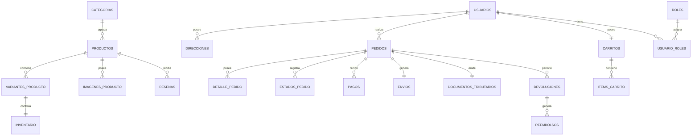
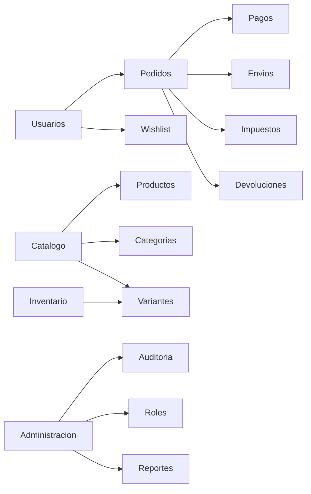

# Modelado de Datos – Plataforma Ecommerce

## 1. Objetivo

Definir la estructura de datos oficial para la plataforma Ecommerce, considerando los requerimientos funcionales actuales y las mejoras necesarias para garantizar escalabilidad, mantenibilidad, trazabilidad y cumplimiento normativo.

El modelo está diseñado para una empresa única que comercializa sus propios productos mediante una plataforma web basada en PHP y MySQL.

---

# 2. Alcance

El modelo contempla los siguientes dominios:

* Gestión de usuarios
* Gestión de roles y permisos
* Catálogo de productos
* Variantes e inventario
* Carrito de compras
* Pedidos
* Pagos
* Envíos
* Impuestos
* Cupones y descuentos
* Wishlist
* Reseñas
* Devoluciones y reembolsos
* Auditoría

---

# 3. Principios de Diseño

## Escalabilidad

La estructura debe permitir crecimiento sin modificaciones disruptivas.

## Trazabilidad

Toda operación crítica debe ser registrable.

## Integridad

Las relaciones deben impedir inconsistencias de negocio.

## Historial

Los cambios de estado y transacciones deben conservarse.

## Compatibilidad

El modelo mantiene compatibilidad conceptual con el diseño original del proyecto.

---

# 4. Entidades Principales

## Usuarios

Representa clientes y administradores.

Campos principales:

* id_usuario
* nombre
* apellido
* email
* password_hash
* habilitado
* fecha_creacion

---

## Roles

Permite implementar RBAC.

Campos:

* id_rol
* nombre
* descripcion

Ejemplos:

* ADMIN
* CLIENTE

---

## UsuarioRoles

Relación N:M entre usuarios y roles.

Campos:

* id_usuario
* id_rol

---

## Direcciones

Direcciones asociadas a usuarios.

Campos:

* id_direccion
* id_usuario
* calle
* numero
* comuna
* ciudad
* region
* codigo_postal

---

# 5. Catálogo

## Categorias

Campos:

* id_categoria
* nombre
* descripcion
* id_padre

Permite categorías jerárquicas.

---

## Productos

Campos:

* id_producto
* id_categoria
* nombre
* descripcion
* precio_base
* slug
* meta_descripcion
* activo

---

## ImagenesProducto

Campos:

* id_imagen
* id_producto
* url_imagen
* principal

---

# 6. Variantes e Inventario

## VariantesProducto

Permite gestionar:

* talla
* color
* SKU
* atributos específicos

Campos:

* id_variante
* id_producto
* sku
* talla
* color
* precio
* activo

---

## Inventario

Stock asociado a cada variante.

Campos:

* id_inventario
* id_variante
* stock_actual
* stock_minimo
* ultima_actualizacion

---

# 7. Carrito

## Carritos

Campos:

* id_carrito
* id_usuario
* activo
* fecha_creacion

---

## ItemsCarrito

Campos:

* id_item
* id_carrito
* id_variante
* cantidad
* precio_snapshot

---

# 8. Pedidos

## Pedidos

Campos:

* id_pedido
* id_usuario
* id_direccion
* subtotal
* descuento_total
* iva_total
* total
* estado_actual
* fecha_creacion

---

## DetallePedido

Snapshot inmutable de la compra.

Campos:

* id_detalle
* id_pedido
* id_variante
* nombre_producto
* sku
* cantidad
* precio_unitario
* descuento_aplicado

---

## EstadosPedido

Historial de estados.

Campos:

* id_estado
* id_pedido
* estado
* fecha_cambio
* usuario_responsable

Estados mínimos:

* pendiente_pago
* pagado
* en_preparacion
* enviado
* entregado
* cancelado

---

# 9. Pagos

## Pagos

Relación 1:N con pedidos.

Campos:

* id_pago
* id_pedido
* metodo_pago
* referencia_externa
* monto
* estado
* fecha_pago

Estados:

* pendiente
* aprobado
* rechazado

Beneficios:

* Reintentos
* Pagos parciales
* Integración con múltiples pasarelas

---

# 10. Cupones y Descuentos

## Cupones

Campos:

* id_cupon
* codigo
* tipo_descuento
* valor
* fecha_inicio
* fecha_fin
* activo

---

## PedidoCupon

Campos:

* id_pedido
* id_cupon

---

# 11. Impuestos

## Impuestos

Campos:

* id_impuesto
* nombre
* porcentaje
* activo

---

## DocumentosTributarios

Campos:

* id_documento
* id_pedido
* tipo_documento
* folio
* fecha_emision
* monto_neto
* iva
* total

Tipos:

* Boleta
* Factura

---

# 12. Envíos

## MetodosEnvio

Campos:

* id_metodo_envio
* nombre
* descripcion

---

## Envios

Campos:

* id_envio
* id_pedido
* id_metodo_envio
* costo_envio
* codigo_seguimiento
* fecha_despacho

---

## EstadosEnvio

Campos:

* id_estado_envio
* id_envio
* estado
* fecha_actualizacion

---

# 13. Wishlist

## ListasDeseos

Campos:

* id_lista
* id_usuario
* fecha_creacion

---

## ListasDeseosDetalle

Campos:

* id_lista
* id_producto

---

# 14. Reseñas

## Resenas

Campos:

* id_resena
* id_producto
* id_usuario
* calificacion
* comentario
* aprobada
* fecha_creacion

---

# 15. Devoluciones y Reembolsos

## Devoluciones

Campos:

* id_devolucion
* id_pedido
* motivo
* estado
* fecha_solicitud

---

## Reembolsos

Campos:

* id_reembolso
* id_devolucion
* monto
* estado
* fecha_reembolso

---

# 16. Auditoría

## AuditoriaSistema

Campos:

* id_auditoria
* entidad
* id_entidad
* accion
* usuario_responsable
* fecha_evento
* detalle

Acciones:

* CREATE
* UPDATE
* DELETE
* LOGIN
* LOGOUT

---

# 17. Relaciones Principales

Usuario 1:N Direccion

Usuario N:M Rol

Usuario 1:N Pedido

Usuario 1:1 Carrito

Categoria 1:N Producto

Producto 1:N VarianteProducto

VarianteProducto 1:1 Inventario

Producto 1:N ImagenProducto

Carrito 1:N ItemCarrito

Pedido 1:N DetallePedido

Pedido 1:N EstadoPedido

Pedido 1:N Pago

Pedido N:M Cupon

Pedido 1:1 DocumentoTributario

Pedido 1:1 Envio

Producto 1:N Resena

Pedido 1:N Devolucion

Devolucion 1:N Reembolso

---

# 18. Reglas de Integridad

* No vender productos sin stock.
* El stock se descuenta únicamente tras confirmación de pago.
* Los usuarios deshabilitados no pueden iniciar sesión.
* Todo pedido debe poseer historial de estados.
* Todo pago debe estar asociado a un pedido válido.
* Toda devolución debe asociarse a un pedido existente.
* Los registros históricos nunca deben eliminarse físicamente.
* Aplicar Soft Delete cuando corresponda.

---

# 19. Consideraciones de Escalabilidad

## Roles

Se reemplaza ENUM por tablas dedicadas.

## Pagos

Se adopta Pedido 1:N Pago.

## Variantes

El inventario se mueve desde Producto hacia VarianteProducto.

## SEO

Se incorpora slug y metadatos.

## Auditoría

Se centraliza la trazabilidad operativa.

## Impuestos

Se habilita cumplimiento tributario.

---

# 20. Diagrama ERD (Mermaid)

# 21. Diagrama de Dominios

# 22. Cambios Respecto al Modelo Inicial

| Cambio                       | Motivo                       |
| ---------------------------- | ---------------------------- |
| Roles mediante tablas        | Escalabilidad                |
| Pago 1:N                     | Reintentos y múltiples pagos |
| Variantes de producto        | Gestión de SKU               |
| Cupones                      | Promociones                  |
| IVA y documentos tributarios | Cumplimiento legal           |
| Envíos                       | Logística                    |
| Wishlist                     | Retención                    |
| Reseñas                      | Confianza                    |
| Devoluciones                 | Postventa                    |
| Auditoría                    | Trazabilidad                 |

---

# 23. Conclusión

La presente propuesta constituye el modelo de datos oficial para la plataforma Ecommerce. El diseño incorpora capacidades de crecimiento, trazabilidad, cumplimiento tributario y soporte para procesos de venta reales, manteniendo compatibilidad con la arquitectura existente y permitiendo futuras extensiones sin rediseños estructurales mayores.
